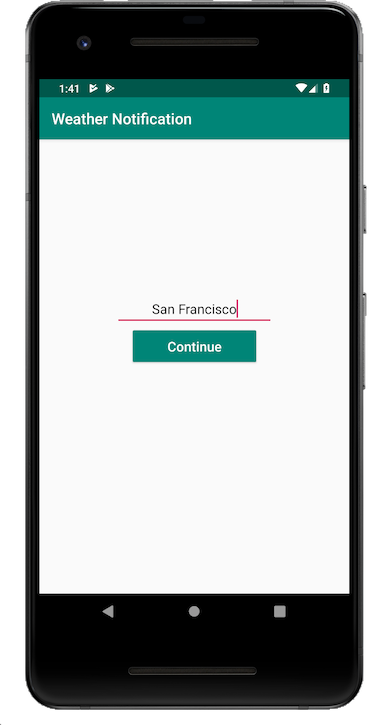
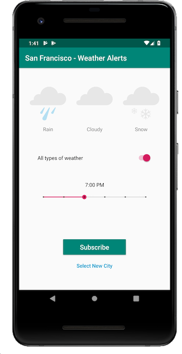
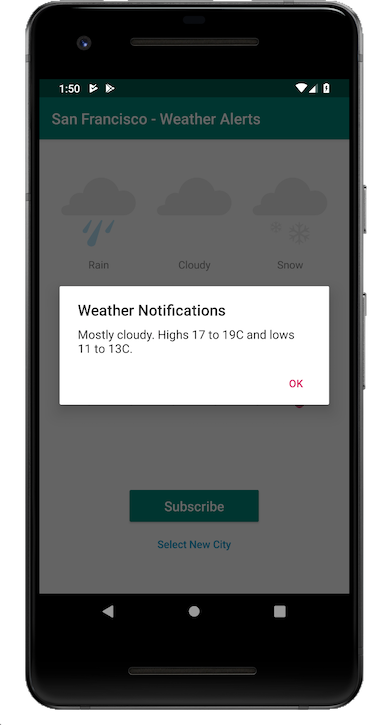
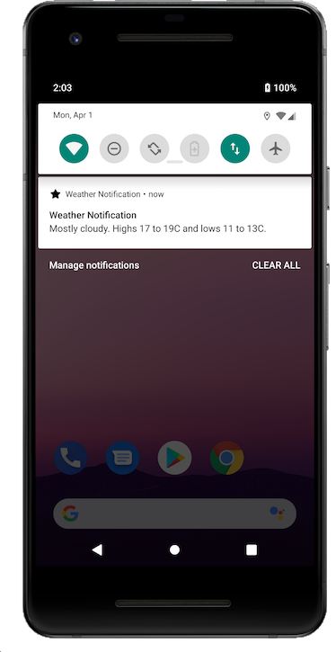

# Create Serverless Functions to send Push Notifications

The application demonstrates IBM Cloud Functions (based on Apache OpenWhisk) that is used as a serverless mobile backend and as a way to send Push Notifications to users. The use case demonstrates how actions work with the mobile app and also execute actions to send notifications at a specific time using Cron job configuration.

The serverless functions will be used as the mobile application's backend. The mobile application is a simple weather alert app that pushes notifications for the weather on the next day. The serverless functions will utilize weather data and process which data will be sent and which subscribers will receive the data. An action will be invoked from the mobile app to create a Push Notification tag and create a cron trigger as well. The cron trigger is used to schedule the actions to be ran at which time of the day.

When the reader has completed this Code Pattern, they will understand how to:

* Create and Deploy Cloud Functions
* Trigger Cloud Functions using Cron in Alarm Trigger
* Use Mobile Push Notifications with Cloud Functions


## Flow

1. User subscribes to a city and chooses the types of weather to subscribe to and select the time to receive the notification.
2. The mobile app invokes a cloud function sequence via REST API that creates a Push notifcation tag.
3. The next action in the sequence is invoked. The action interacts with the Cloud Function framework to create a cron trigger with the necessary data like location and weather types.
4. The trigger will be fired at the specific time set by the user. The trigger will invoke a sequence via a configured rule. The action invoked will get data from the Weather Company Data.
5. The next action in the sequence receives the data and will build the message according to what the user requested of what weather type.
6. The next action in the sequence is interfaced with the Push Notification service that will finally push a notification to the user.

# Prerequisites

* [IBM Cloud Functions CLI](https://console.bluemix.net/openwhisk/learn/cli) to create cloud functions from the terminal. Make sure you do the test action `ibmcloud fn action invoke /whisk.system/utils/echo -p message hello --result` so that your `~/.wskprops` is pointing to the right account.

* [Whisk Deploy _(wskdeploy)_](https://github.com/apache/incubator-openwhisk-wskdeploy) is a utility to help you describe and deploy any part of the OpenWhisk programming model using a Manifest file written in YAML. You'll use it to deploy all the Cloud Function resources using a single command. You can download it from the [releases page](https://github.com/apache/incubator-openwhisk-wskdeploy/releases) and select the appropriate file for your system.

> You can also use `ibmcloud fn deploy`. This has the same functionality integrated with the `ibmcloud` CLI.

* [Android Studio](https://developer.android.com/studio/)

# Steps

1. [Clone the repo](#1-clone-the-repo)
2. [Create IBM Cloud Services](#2-create-ibm-cloud-services)
3. [Deploy Cloud Functions](#3-deploy-cloud-functions)
4. [Configure credentials](#4-configure-credentials)
5. [Launch mobile application](#5-launch-mobile-application)

### 1. Clone the repo

Clone the `ibm-cloud-functions-serverless-mobile-push` locally. In a terminal, run:

```
$ git clone https://github.com/IBM/ibm-cloud-functions-mobile-push-notifications
$ cd ibm-cloud-functions-mobile-push-notifications
```

### 2. Create IBM Cloud Services

<!-- configure push notification -->
Create and configure the Push Notification Service:

* [Push Notifications](https://cloud.ibm.com/catalog/services/push-notifications)
* [Android's Push Notification FCM](https://cloud.ibm.com/docs/services/mobilepush?topic=mobile-pushnotification-push_step_1#push_step_1_android)
* [Configure your Push Notification service with your FCM credentials](https://cloud.ibm.com/docs/services/mobilepush?topic=mobile-pushnotification-push_step_2#push_step_2_Android)

Create Weather Company Data Service:

*  [Weather Company Data](https://cloud.ibm.com/catalog/services/weather-company-data)
* Copy the username and password of the Weather Company Data service and paste it in the `local.env` file.

### 3. Deploy Cloud Functions

First, you will need to install Push Notifications package. This deploys a set of actions that uses the Push Notification service from IBM Cloud.

```
$ git clone https://github.com/ibm-functions/package-push-notifications
$ pushd package-push-notifications/runtimes/nodejs/
$ ibmcloud fn deploy
$ popd
```

**Choose one of the two deployment methods:**

## Deploy using the `ibmcloud fn deploy` or `wskdeploy` command line tool

This approach deploy the Cloud Functions with one command driven by the runtime-specific manifest file available in this repository.

Make sure you have the right environment variables in the `local.env` file. Export them in your terminal then deploy the Cloud Functions using `ibmcloud fn deploy`. This uses the `manifest.yaml` file in this repo's root directory.

The [manifest.yaml](manifest.yaml) describes all the Actions, Packages, Triggers and Rules and deploys them with one command.

```
$ source local.env
$ ibmcloud fn deploy
```

> You may want to undeploy them later with `ibmcloud fn undeploy`

> Want to learn more about `wskdeploy`? Check out the [repository](https://github.com/apache/incubator-openwhisk-wskdeploy#Whisk-Deploy-wskdeploy)

## Deploy manually with the `ibmcloud fn` command line tool

Go to [Alternative Deployment Methods](#alternative-deployment-methods) section

### 4. Configure credentials

* Bind the Push Notification service to your Cloud Function packages.

```
$ ic fn service bind imfpush push-notifications --instance <instance-name-of-your-push-notification-service>
$ ic fn service bind imfpush push-notification-sample --instance <instance-name-of-your-push-notification-service>
```

* Modify mobile application to use your service and actions

Get the REST API that will be used by the mobile app.

```
$ ibmcloud fn api list | grep serverless-mobile-backend
/<>/push-notification-sa    post  serverless-mobile-backend  https://service.us.apiconnect.ibmcloud.com/gws/apigateway/api/<>/backend/trigger-sequence
```

Modify Android's xml file `android/app/src/main/res/values/strings.xml`. Use your own Push Notification's credentials: `appGuid` and `clientSecret`. Use the URL from the REST API that you got from the previous step.

```xml
...
<string name="PUSH_NOTIFICATION_APP_GUID">123-45-6789</string>
<string name="PUSH_NOTIFICATION_CLIENT_SECRET">123-45-6789</string>
<string name="SERVERLESS_API_URL">https://service.us.apiconnect.ibmcloud.com/gws/apigateway/api/<>/backend/trigger-sequence</string>
...
```

### 5. Launch mobile application

* You will need Android studio to run the application. You could test the Android app either in an [emulator](https://developer.android.com/studio/run/emulator) in Android Studio or on a [real device](https://developer.android.com/studio/run/device).

* Once it is running, the app will ask you to enter a City name to which you want to subscribe weather alerts to. The alert will be about the weather for tomorrow. You can choose which type of weather to subscribed to and at what time you want to receive push notifications.

* You can also fire the trigger and receive the push notification now.

```
$ ibmcloud fn trigger list
triggers
/Anthony.Amanse_dev/san-francisco-any-5                                private
/Anthony.Amanse_dev/seattle-any-3                                      private
/Anthony.Amanse_dev/manila-any-0                                       private
...
```

* Triggers that are created from the app will look like `<city-name>-<type-of-weather>-<0-5>` (0 is "5PM" and 5 is "10PM"). Get the one you are subscribed to. You would also see an alert dialog containing the trigger name from the app when you click on subscribe within the app.

```
$ ibmcloud fn trigger get san-francisco-any-5
{
...
"result": {
    "config": {
        "cron": "0 22 * * *",
        "name": "san-francisco-any-5",
        "namespace": "Namespace_dev",
        "payload": {
            "isAlertAll": true,
            "latitude": 37.7749295,
            "longitude": -122.41941550000001,
            "pushNotificationTag": "san-francisco-any-5",
            "weather": []
        },
        "timezone": "America/Los_Angeles"
    },
...
```

* Create `test.json` and paste the JSON from the value of `payload`:

**test.json** file
```json
{
  "isAlertAll": true,
  "latitude": 37.7749295,
  "longitude": -122.41941550000001,
  "pushNotificationTag": "san-francisco-any-5",
  "weather": []
}
```

* Fire the trigger

```
$ ibmcloud fn trigger fire san-francisco-any-5 -P test.json
```

# Sample output






# Alternative Deployment Methods

### Deploy manually with the `ibmcloud fn` command line tool

This approach shows you how to deploy individual the packages, actions, triggers, and rules with CLI commands. It helps you understand and control the underlying deployment artifacts. These manual steps are equivalent to what was described and deployed in `wskdeploy` tool using the [manifest.yaml](manifest.yaml).

* Export the credentials in your environment

```
$ source local.env
```

* Create the actions

Create a package to organize the actions that will be created for this repo.

```
$ ibmcloud fn package create push-notification-sample
```

Then create the actions into the package.

```
$ ibmcloud fn action create push-notification-sample/build-message actions/build-message.js \
--kind nodejs:10

$ ibmcloud fn action create push-notification-sample/create-tag actions/create-tag.js \
--kind nodejs:10

$ ibmcloud fn action create push-notification-sample/create-trigger actions/create-trigger.js \
--kind nodejs:10

$ ibmcloud fn action create push-notification-sample/get-three-day-weather actions/get-three-day-weather.js \
--kind nodejs:10 \
--param username $WEATHER_USERNAME \
--param password $WEATHER_PASSWORD
```

* Create the sequences

```
$ ibmcloud fn action create push-notification-sample/create-tag-and-trigger --sequence push-notification-sample/create-tag,push-notification-sample/create-trigger --web true

$ ibmcloud fn action create push-notification-sample/get-weather-and-send-notification --sequence push-notification-sample/get-three-day-weather,push-notification-sample/build-message,push-notifications/send-message
```

* Create REST API

```
$ ibmcloud fn api create /backend /trigger-sequence post push-notification-sample/create-tag-and-trigger -n serverless-mobile-backend --response-type json
```

You can now proceed to the [next step](#4-modify-configuration-for-cloud-functions-and-mobile-applictaion).

To delete them later:

```
$ ibmcloud fn action delete push-notification-sample/build-message
$ ibmcloud fn action delete push-notification-sample/create-tag
$ ibmcloud fn action delete push-notification-sample/create-trigger
$ ibmcloud fn action delete push-notification-sample/get-three-day-weather
$ ibmcloud fn action delete push-notification-sample/create-tag-and-trigger
$ ibmcloud fn action delete push-notification-sample/get-weather-and-send-notification
$ ibmcloud fn api delete serverless-mobile-backend
$ ibmcloud fn package delete push-notification-sample
```

# Links

* [Apache OpenWhisk](http://openwhisk.incubator.apache.org/): Open source cloud platform that executes functions in response to events at any scale.

# License
This code pattern is licensed under the Apache Software License, Version 2.  Separate third party code objects invoked within this code pattern are licensed by their respective providers pursuant to their own separate licenses. Contributions are subject to the [Developer Certificate of Origin, Version 1.1 (DCO)](https://developercertificate.org/) and the [Apache Software License, Version 2](http://www.apache.org/licenses/LICENSE-2.0.txt).

[Apache Software License (ASL) FAQ](http://www.apache.org/foundation/license-faq.html#WhatDoesItMEAN)
